# 1. 计算机网络和因特网

## 1.1 什么是因特网

### 1.1.1 具体构成描述

因特网是一个世界范围的计算机网络.

所有连入计算机网络的设备称为 **主机(host)** 或 **端系统(end system)** .

端系统通过 **通信链路(communication link)** 和 **分组交换机(packet switch)** 的网络连接到一起.

不同的链路能够以不同的速率传输数据,链路的 **传输速率(transmission rate)** 以比特/秒(bit/s或bps)度量.

当一台端系统要向另一台端系统发送数据时,发送端系统将数据分段,并为每段加上首部字节,由此形成的信息包就是 **分组(packet)** .

在当今因特网中,两种常见类型的分组交换机是 **路由器(router)** 和 **链路层交换机(link-layer switch)** .

端系统通过 **因特网服务提供商(Internet Service Provider,ISP)** 接入因特网.

端系统,分组交换机和其它因特网部件都要运行多个 **协议(protocol)** ,这些协议控制因特网中信息的接收和发送.

**TCP(Transmission Control Protocol,传输控制协议)** 和 **IP(Internet Protocol,网际协议)** 是因特网中两个最为重要的协议.IP协议定义了在路由器和端系统之间发送和接收的分组格式.因特网的主要协议统称为 **TCP/IP** .

**因特网标准(Internet standard)** 由 **因特网工程任务组(Internet Engineering Task Force,IETF)[IETF 2020]** 研发.

IETF的标准文档称为 **请求评论(Request For Comment,RFC)** .RFC最初只是普通的请求评论(因此而得名),目的是解决因特网先驱者面临的网络和协议问题[Allman 2011].RFC文档往往技术性很强并且是相当详细的.它们定义了TCP,IP,HTTP(用于Web)和SMYP(用于电子邮件)等协议.

> * 节点
>   * 主机及其上运行的应用程序
>   * 路由器,交换机等网络交换设备
> * 边:通信链路
>   * 接入网链路:主机连接到互联网的链路
>   * 主干网链路:路由器间的链路

### 1.1.2 服务描述

因特网应用涉及多个相互交换数据的端系统,故被称为 **分布式应用(distributed application)** .因特网应用运行在端系统上,及它们并不运行在网络核心中的分组交换机上.尽管分组交换机能够加速端系统之间的数据交换,但它们并不关注作为数据的源或宿的应用.

与因特网相连的端系统提供了一个 **套接字接口(socket interface)** ,该接口规定了运行在一个端系统上的程序请求因特网基础设施向运行在另一个端系统上的特定目的地程序交付数据的方式.因特网套接字接口时一套发送程序必须遵循的规则集合,因此因特网能够将数据交付给目的地.

> * 协议控制发送,接收信息
>   * 如TCP,IP,HTTP,FTP,PPP
> * Internet:"网络的网络"
>   * 松散的层次结构,互连的ISP
>   * 公共Internet vs. 专用intranet
> * Internet标准
>   * RFC:Request for comments
>   * IETF:Internet Engineering Task Force

### 1.1.3 什么是协议

在因特网中,涉及两个或多个远程通信实体的所有活动都受协议的制约.

**协议(protocol)** 定义了两个或多个通信实体之间交换的 **报文** 的 **格式** 和 **顺序** ,以及报文的发送/接收或其它事件所采取的 **操作** .

> * 网络边缘
>   * 主机
>   * 应用程序(客户端和服务器)
> * 网络核心
>   * 互连着的路由器
>   * 网络的网络
> * 接入网,物理媒体
>   * 有线或者无线通信链路

## 1.2 网络边缘

通常把与因特网相连的计算机和其它设备称为端系统,因为它们位于因特网的边缘,故而被称为端系统.

主机有时又被进一步划分为两类: **客户(client)** 和 **服务器(server)** .

今天,大部分提供搜索结果,电子邮件,Web网页,视频和移动应用内容的服务器都属于大型 **数据中心(data center)** .

> 网络边缘:采用基础设施的无连接服务.

> * 端系统(主机)
>   * 运行应用程序
>   * 如Web,email
>   * 在"网络的边缘"
> * 客户/服务器模式
>   * 客户端向服务器请求,接收服务
>   * 如Web浏览器/服务器;email客户端/服务器
> * 对等(peer-peer)模式
>   * 很少(甚至没有)专门的服务器
>   * 如Gnutella,KaZaA,Emule

> * **UDP(User Datagram Protocol,用户数据报协议)[RFC 768]**
>   * 无连接
>   * 不可靠数据传输
>   * 无流量控制
>   * 无拥塞控制

> 使用TCP的应用:
> * HTTP(Web),FTP(文件传送),Telnet(远程登入),SMTP(email)
> 使用UDP的应用:
> * 流媒体,远程会议,DNS,Internet电话

### 1.2.1 接入网

**接入网** 是指将端系统物理连接到其 **边缘路由器(edge router)** 的网络.边缘路由器是端系统到任何其它远程端系统的路径上第一台路由器.

1. 家庭接入:DSL,电缆,FTTH和5G固定式无线
2. 企业(和家庭)接入:以太网和WiFi
3. 广域无线接入:3G,LTE 4G和5G

### 1.2.2 物理媒介

1. 双绞铜线
2. 同轴电缆
3. 光纤
4. 陆地无线电信道
5. 卫星无线电信道

## 1.3 网络核心

网络核心,即由互联因特网端系统的分组交换机和链路构成的网状网络.

通过网络链路和交换机移动数据又两种基本方法: **电路交换(circuit switching)** 和 **分组交换(packet switching)** .

### 1.3.1 分组交换

在某种网络应用中,端系统彼此交换 **报文(message)** .报文能够包含该应用的设计者需要的任何东西.报文可以执行一种控制功能,也可以包含数据.

为了从源端系统向目的端系统发送一个报文,源将长报文划分为较小的数据块,称为 **分组(packet)** .

在源和目的地之间,每个分组都通过通信链路和 **分组交换机(packet switch)** 传送,交换机主要有 **路由器(router)** 和 **链路层交换机(link-layer switch)** 两类.

分组交换机以等于该链路最大传输速率的速度通过通信链路.

> 如果某源端系统或分组交换机经过一条链路发送一个 $L bit$ 的分组,链路的传输速率为 $R bps$ ,则传输该分组的时间为 $L/R s$ .

1. 存储转发传输
   多数分组交换机在链路的输入端使用 **存储转发传输(store-and-forward transmissiong)** 机制.  
   存储转发传输是指在交换机开始向输出链路传输第一个比特之前,必须接收到整个分组.
   
   通过由 $N$ 条速率均为 $R$ 的链路组成的路径(在源和目的地间有 $N-1$ 台路由器),从源到目的地发送一个分组.端到端时延是:
   $$
   d_{end-end}=N \frac{L}{R}
   $$
2. 排队时延和分组丢失
   每台分组交换机有多条链路与之相连,对于每条相连的链路,该分组交换机具有一个 **输出缓存[output buffer,也称输出队列(output queue)]** ,它用于存储路由器准备发往那条链路的分组.  
   如果到达的分组需要传输到某条链路,但发现该链路正忙于传输其它分组,该到达分组必须在输出缓存中等待.因此,除了存储转发时延外,分组还要承受输出缓存的 **排队时延(queuing delay)** .  
   因为缓存大小是有限的,一个到达的分组可能发现该缓存已被其它等待传输的分组完全充满了.在此情况下,将出现 **分组丢失(丢包)(packet loss)** .
3. 转发表和路由器选择协议
   在因特网中,每个端系统具有一个称为IP地址的地址.当源主机要向目的端系统发送一个分组时,源在该分组的首部中包含了目的地的IP地址.  
   每台路由器具有一个 **转发表(forwarding table)** ,用于将目的地址(或目的地址的一部分)映射为输出链路.  
   因特网具有一些特殊的 **路由选择协议(routing protocol)** ,用于自动设置这些转发表.

### 1.3.2 电路交换

在电路交换网中,在端系统间通信会话期间,预留了端系统间沿路径通信所需要的资源.在分组交换网络中,这些资源则不是预留的.

当两台主机要通信时,网络在两台主机之间创建一条专用的 **端到端连接(end-to-end connection)** .

1. 电路交换网络中的复用
   链路中的电路是通过 **频分复用(Frequency-Division Multiplexing,FDM)** 或 **时分复用(Time-Division Multiplexing,TDM)** 来实现的.  
   对于FDM,链路的频谱由跨越链路创建的所有连接共享.在连接期间链路为每条连接专设一个频段,该频段的宽度称为 **带宽(band-width)** .  
   对于TDM,时间被划分为固定时段的帧,并且每个帧又被划分为固定数量的时隙.当网络跨越一条链路创建一条连接时,网络在每个帧中为该连接指定一个时隙.这些时隙专门由该连接单独使用,一个时隙(在每个帧内)可用于传输该连接的数据.
2. 分组交换与电路交换的对比
   分组交换不适合实时服务,因为它的端到端时延是可变的和不可预测的.
   分组交换提供了比电路交换更好的带宽共享;它比电路交换更简单,更有效,实现成本更低.

### 1.3.3 网络的网络

端系统经过一个接入ISP与因特网相连,接入ISP自身互连,创建"网络的网络".

*网络结构1* 用单一的全球传输ISP互联所有接入ISP.

*网络结构2* 由数十万接入ISP和多个全球传输ISP组成.

*网络结构3* 不仅有多个竞争的第一层ISP,而且在一个区域可能有多个竞争的区域ISP,每个接入ISP向其连接到区域ISP支付费用,每个区域ISP向其连接的第一层ISP支付费用.

**存在点(Point of Point,PoP)** 存在于等级结构的所有层次,但底层(接入ISP)等级除外.一个PoP只是提供商网络中的一台或多台路由器(在相同位置)群组.对于要与提供商PoP连接的客户网络,它能从第三方电信提供上租用高速链路并将它的路由器之一直接连接到位于该PoP的一台路由器.

任何ISP(除了第一层ISP)都可以选择 **多宿(multi-home)** ,即可以与两个或更多提供商ISP连接.

为了减少客户ISP支付给提供商ISP的费用,位于相同等级结构层次的邻近的一对ISP能够 **对等(peer)** ,也就是说,能够直接将它们的网络连到一起.

第三方公司能够创建一个 **因特网交换点(Internet Exchange Point,IXP)** ,IXP是一个汇合点,多个IXP能够在这里一起对等.

*网络结构4* 由接入ISP,区域ISP,第一层ISP,PoP,多宿,对等和IXP组成.

*网络结构5* 通过在网络结构4顶部增加 **内容提供商网络(content provider network)** 构建而成.

## 1.4 分组交换网中的时延,丢包和吞吐量

### 1.4.1 分组交换网中的时延

* 节点总时延(total nodal delay)
  * 节点处理时延(nodal processing delay)
  * 排队时延(queuing delay)
  * 传输时延(transmission delay)
  * 传播时延(propagation delay)

$$
d_{nodal}=d_{proc}+d_{queue}+d_{trans}+d_{prop}
$$

### 1.4.2 排队时延和丢包

节点时延的最为复杂和有趣的成分是排队时延 $d_{queue}$ .当表征排队时延时,人们通常使用统计量来度量,如平均排队时延,排队时延的方差等.

排队时延取决于流量到达该队列的速率,链路的传输速率和到达流量的性质,即流量是周期性到达还是以突发形式到达.

令 $a$ 分组到达队列的平均速率( $a$ 的单位是 分组/秒 ,即 $pkt/s$ ), $R$ 是传输时延,即从队列中推出比特的速率(以 $bps$ 为单位).假设所有分组都是由 $L bit$ 组成,则比特到达队列的平均速率是 $La bps$ .假定该队列非常大,能容纳无限数量的比特.比率 $La/R $ 被称为 **流量强度(traffic intensity)** ,它在估计排队时延的范围常起着重要作用.如果 $La/R \gt 1$ 则比特到达队列的平均速率超过从该队列传输出去的速率.该队列趋向于无限增加,并且排队时延将趋向于无穷大.因此,流量工程中,设计系统时流量强度不能大于1.

### 1.4.3 端到端时延

$$
d_{end-end}=N(d_{proc}+d_{trans}+d_{prop})
$$

### 1.4.4 计算机网络中的吞吐量

从主机A到主机B跨越计算机网络传送一个大文件.在任何时间, **瞬时吞吐量(instantaneous throughput)** 是主机B接收到该文件的速率(以bps计).

如果该文件由 $F bit$组成,主机B接收到所有 $F bit$ 用去 $T s$ ,则文件传送的 **平均吞吐量(average throughput)** 是 $F/T bps$ .

## 1.5 协议层次及其服务模型

### 1.5.1 分层的体系结构

**协议分层**
网络设计者以 **分层(layer)** 的方式组织协议并实现这些协议的网络硬件和软件.每个协议属于这些层次之一.我们关注某层向它的上一层提供的 **服务(service)** ,即所谓一层的 **服务模型(service model)** .

各层的所有协议被称为 **协议栈(protoco stack)** .

### 1.5.2 封装

在发送主机端,一个 **应用层报文(application-layer message)** 被传送给运输层.

## 1.6 面对攻击的网络

## 1.7 计算机网络和因特网的历史

### 1.7.1 分组交换的发展:1961~1972

### 1.7.2 专用网络和网络互联:1972~1980

### 1.7.3 网络的激增:1980~1990

### 1.7.4 因特网爆炸:20世纪90年代

### 1.7.5 最新发展

## 1.8 小结