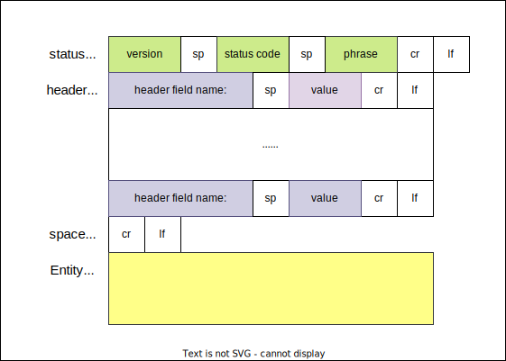

# 2. 应用层

## 2.1 网络应用原理

### 2.1.1 网络应用体系结构

**应用体系结构(application architecture)** 由应用程序研发者设计,规定了如何在各种端系统上组织该应用程序.

两种主流体系结构:客户-服务器体系结构或对等(P2P)体系结构.

在 **客户-服务器体系结构(client-server architecture)** 中,有一个总是打开的主机,称为服务器,他服务于来自许多其它称为客户的主机的请求.

在 **P2P体系结构(P2P architecture)** 中,对位于数据中心的专用服务器有最小的(或者没有)依赖.

### 2.1.2 进程通信

进行通信的实际上是 **进程(process)** 而不是程序.

1. 客户和服务器进程
   对每对通信进程,我们通常将这两个进程之一标识为 **客户(client)** ,而另一个进程标识为 **服务器(server)** .
2. 进程与计算机网络之间的接口
   进程通过一个称为 **套接字(socket)** 的软件接口向网络发送报文和从网络接收报文.
   套接字是同一台主机内应用层与运输层之间的接口.套接字也称为应用程序和网络之间的 **应用编程接口(Application Programming Interface,API).
3. 进程寻址
   在一台主机上运行的进程为了向另一台主机上运行的进程发送分组,接收进程需要有一个地址.为了标识该接收进程,需要定义两种信息:主机的地址,在目的主机中指定接收进程的标识符.
   在因特网中,主机由其 **IP地址(IP address)** 标识.
   目的地 **端口号(port number)** 用于指定运行在接受主机上的接收进程.

### 2.1.3 可供应用程序使用的运输服务

1. 可靠数据传输
2. 吞吐量
3. 定时
4. 安全性

### 2.1.4 因特网提供的运输服务

1. TCP服务
   TCP服务模型包括面向连接服务和可靠数据传输服务.
   * 面向连接的服务:在应用层数据报文开始流动之前,TCP让客户和服务器相互交换运输层控制信息.这个所谓的握手过程提醒客户和服务器,让它们为大量分组的到来做好准备.在握手阶段后,一个 **TCP连接(TCP connection)** 就在两个进程的套接字之间建立了.这条连接是全双工的,即连接双方的进程可以在此连接上同时进行报文收发.
   * 可靠的数据传输服务:通信进程能够依靠TCP,无差错,按适当顺序交付所有发送的数据.当应用程序的一端将字节流传进套接字时,它能够依靠TCP将相同的字节流交付该接收方的套接字,而没有字节的丢失和冗余.  
  > 无论是TCP还是UDP都没有提供任何加密机制,这就是说发送进程传进其套接字的数据,与网络传送到目的进程的数据相同.  
  > 因特网界已经研制了TCP的加强版本,称为 **运输层安全(Transport Layer Security,TLS)[RFC 5246]** .
2. UDP服务
   UDP是一种不提供不必要服务的轻量级运输协议,它仅提供最低限度的服务.UDP是无连接的,因此在两个进程通信前没有握手过程.UDP提供一种不可靠数据传输服务,也就是说当进程将一个报文发送进UDP套接字时,UDP并不保证该报文将到达接收进程.不仅如此,到达接收进程的报文也可能是乱序到达的.
3. 因特网运输协议所不提供的服务
   因特网通常能够为时间敏感应用提供满意的服务,但它不能提供任何定时或吞吐量的保证.

|应用|应用层协议|支撑的运输协议|
|-|-|-|
|电子邮件|SMTP[RFC 5321]|TCP|
|远程终端访问|Telnet[RFC 854]|TCP|
|Web|HTTP[RFC 7230]|TCP|
|文件传输|FTP[RFC 959]|TCP|
|流式多媒体|HTTP,DASH|TCP|
|因特网电话|SIP[RFC 3261],RTP[RFC 3550]|UDP或TCP|

### 2.1.5 应用层协议

**应用层协议(application-layer protocal)** 定义了运行在不同端系统上的应用程序进程如何相互传递报文.特别是,应用层协议定义了以下内容:
* 交换点报文类型,例如请求报文和响应报文.
* 各种报文类型的语法,如报文中的各个字段及这些字段是如何描述的.
* 字段的语义,即这些字段中信息的含义.
* 确定一个进程何时以及如何发送报文,对报文进行响应的规则.

## 2.2 Web和HTTP

### 2.2.1 HTTP概述

Web的应用层协议是 **超文本传输协议(HyperText Transfer Protocol,HTTP)** ,它是Web的核心.HTTP由两个程序实现:一个客户程序和一个服务器程序.

**Web页面(Web page)** 是由对象组成的.一个 **对象(object)** 只是一个文件,诸如一个HTML文件,一个JEPG图形,一个JavaScript文件,一个CCS样式表文件或一个视频片段,它们可以通过一个URL寻址.

多数Web页面含有一个 **HTML基本文件(base HTML file)** 及几个引用对象.

每个URL由两部分组成:存放对象的服务器主机名和对象的路径名.

HTTP定义了Web客户向Web服务器请求Web页面的方式,以及服务器向客户传送Web页面的方式.

服务器向客户发送被请求的文件,而不存储任何关于该客户的状态信息.假如某个特定的客户在短短的几秒内两次请求同一个对象,服务器并不会因为刚刚为该客户提供了该对象就不再做出反应,而是重新发送该对象.因为服务器并不保存关于客户的任何信息,所以我们说HTTP是一个 **无状态协议(stateless protocol)** .

### 2.2.2 非持续连接和持续连接

**非持续链接(non-persistent connection)** :每个请求/响应对是经一个单独的TCP连接发送.
**持续连接(persistent connection)** :所有的请求及其响应经相同的TCP连接发送.

1. 采用非持续连接的HTTP
   假设服务器向客户传送一个含有一个HTML基本文件和10个JPEG图形的Web文件.
   1. HTTP客户进程在端口号80发起一个到服务器的TCP连接.
   2. HTTP客户经它的套接字向该服务器发送一个HTTP请求报文.
   3. HTTP服务器进程经它的套接字接收该请求报文,从其存储器中检索出对象,在一个HTTP响应报文中封装对象,并通过套接字向客户发送响应报文.
   4. HTTP服务器进程通知TCP断开该TCP连接.
   5. HTTP客户接收响应报文,TCP连接关闭.该报文指出封装的对象是一个HTML文件,客户从响应报文中提取出该文件,检查该HTML文件,得到对10个JPRG图形的引用.
   6. 对每个引用的JPEG图形重复前4个步骤.
2. 采用持续连接的HTTP
   在采用HTTP1.1持续连接的情况下,服务器在发送响应后保持该TCP连接打开.在相同的客户与服务器之间,后续的请求和响应报文能够通过相同的连接进行传送.

### 2.2.3 HTTP报文格式

HTTP规范[RFC 1954;RFC 7230;RFC 7540]包含了对HTTP报文格式的定义.

HTTP报文有两种:请求报文和响应报文.

1. HTTP请求报文
   一个典型的HTTP请求报文:
   ```
   GET /somedir/page.html HTTP/1.1
   Host: www.someschool.edu
   Connection: close
   User-agent: Mozilla/5.0
   Accept-lauguage: fr

   ```
   一个请求报文能够具有更多的行或至少为一行.
   一个额外的换行回车符表示报文结束.
   HTTP请求报文的第一行叫作 **请求行(request line)** 其后继的行叫作 **首部行(header line)** .
   请求行有3个字段:方法字段,URL字段,HTTP版本字段.
   HTTP请求方法:
   |方法|描述|
   |-|-|
   |GET|请求指定的页面信息,并返回实体主体.|
   |HEAD|类似于 `GET` 请求,只不过返回的响应中没有具体的内容,用于获取报头.|
   |POST|向指定资源提交数据进行处理请求(例如提交表单或者上传文件).数据被包含在请求体中. `POST` 请求可能会导致新的资源的建立和/或已有资源的修改.|
   |PUT|从客户端向服务器传送的数据取代指定的文档的内容.|
   |DELETE|请求服务器删除指定的页面.|

   绝大部分的HTTP请求报文使用GET方法.
   首部行 `Host: www.someschool.edu` 指明了对象所在的主机.该首部行提供的信息是Web代理高速缓存所要求的.
   通过包含 `Connection: close` 首部行,该浏览器告诉服务器不要麻烦地使用持续连接,它要求服务器在发送完被请求的对象后就关闭这条连接.
   `User-agent:` 用来指明用户代理,即向服务器发送请求的浏览器类型.这里的 `Mozilla/5.0` 即 `Fire-fox` 浏览器.
   `Accept-language: fr` 表示用户想得到该对象的法语版本,否则服务器发送它的默认版本.
   
2. HTTP响应报文
   ```
   HTTP/1.1 200 OK
   Connection: close
   Date: Tue, 18 Aug 2015 15:44:04 GMT
   Server: Apache/2.2.3(CentOS)
   Last-Modified: Tue
   ```
   
   常见状态码:
   * 200 OK
   * 301 Moved Permanently
   * 400 Bad Request
   * 404 Not Found
   * 505 HTTP Version Not Supported

### 2.2.4 用户与服务器的交互:cookie

HTTP服务器是无状态的.这简化了服务器的设计,并允许工程师取开发可以同时处理数千个TCP连接的高性能服务器.然而一个Web站点通常希望能够识别用户,可能是因为服务器希望限制用户的访问,或者因为它希望把内容与用户身份联系起来.为此,HTTP使用了 *cookie* . *cookie* 在[RFC 6265] 中定义,它允许站点对用户进行跟踪.

### 2.2.5 Web缓存(代理服务器)

目标:不访问原始服务器,就满足客户的请求.

### 2.2.6 HTTP/2